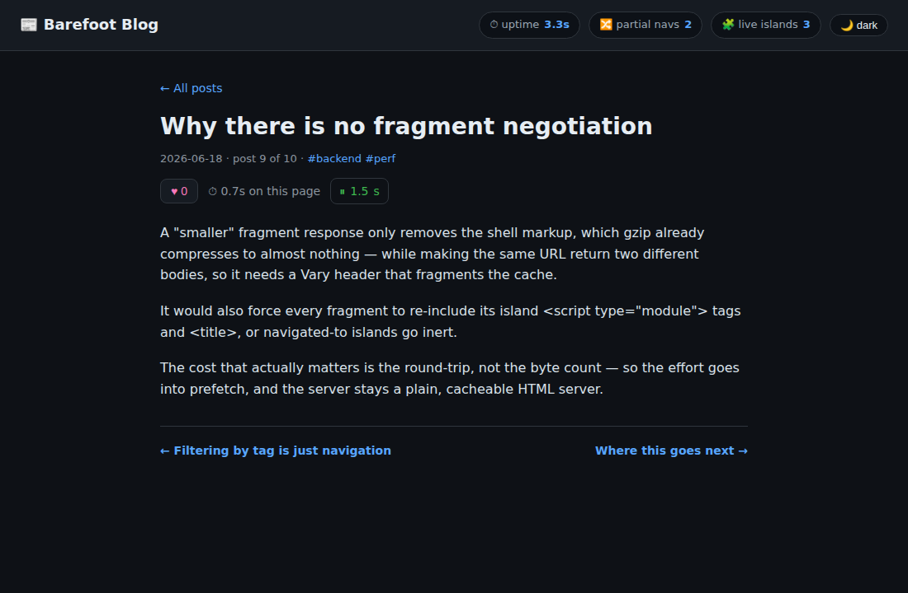

# Router blog — `@barefootjs/router` reference (real-component edition)

A small blog built on [`@barefootjs/router`](../../packages/router) for
**automatic partial navigation**: clicking a post swaps only the
`<main bf-region>` content and leaves the page shell mounted; clicking a
`?sort=` / `?tag=` link re-orders/filters the list **reactively with no region
swap at all**; and a marked mini-player keeps **playing across a navigation**.

Every island here is a **real compiled BarefootJS `"use client"` component**
hydrated by the **real `@barefootjs/client` runtime** — the router drives the
actual `__bf_hydrate_within` / `__bf_dispose_within` seams, not a hand-written
stand-in. So this doubles as an end-to-end integration test of the router's
**v0 / v0.5 / v1** against the shipping compiler + runtime.


## What it shows

| Screenshot | Demonstrates |
|---|---|
|  | First load: the index list + sort/tag controls. The shell shows `uptime · partial navs · live islands`, all hydrated once. |
|  | **v0.5 `searchParams()`:** clicking `sort` / `tag` re-orders/filters the list reactively — **`partial navs` stays 0** (no region swap) while the list and the controls' active state update. A pinned post keeps its state across a re-sort. |
|  | **v0** After opening a post (post 10, `partial navs 1`): the body is swapped in, **uptime kept climbing**. The ▶ NowPlaying player (marked `data-bf-permanent`) is playing — elapsed `0.7s`. |
|  | **v1** After paging to the next post (post 9, `partial navs 2`): the player's clock **continued to `1.5s`** — the same live node was moved across the swap — while the unmarked ⏱ reading timer **reset** to `0.7s`. Same region, same swap, only the marker differs. |

The header is the proof of v0's persistent shell: its uptime clock and theme
toggle start **once**. A full reload would reset them. Only `<main bf-region>`
is replaced.

## Components (all real `"use client"`)

| Component | Where | Role |
|---|---|---|
| `ShellStats` | shell | uptime clock + a `MutationObserver` partial-nav counter + live-island gauge |
| `ThemeToggle` | shell | flips `data-theme`; the choice survives navigation |
| `PostList` | region | the index; reads `searchParams()` to sort/filter with no swap; reactive sort/tag bars |
| `PostListItem` | region | one keyed row with a local pin toggle (state survives re-sort) |
| `LikeButton` | region | local like counter — re-created per navigation |
| `ReadingTimer` | region | a `setInterval` timer wired through `onCleanup` — the **disposal** stress case |
| `NowPlaying` | region | a mini-player whose root carries `data-bf-permanent` — the **v1 persistence** case (live node + state survive a swap) |

## How it works

- **Server** (`server.tsx`): plain Bun + Hono. Every route returns the **full
  page**; the router extracts the `[bf-region]` content client-side (no
  content-negotiation header, no route table). 10 posts, `?tag=` filtering,
  `?sort=` ordering. A side-effect `import '@barefootjs/hono/app'` auto-wires
  request-scoped `searchParams()` for SSR.
- **Compile** (`bf build`): the `.tsx` islands compile to `*.client.js` +
  `barefoot.js`. `BfScripts` emits the module scripts at body end; the router
  reads them off each navigation response to load any newly-required island
  before re-hydrating.
- **Bootstrap** (`client/router-entry.ts`): installs the runtime seams
  (`setupStreaming`) and starts the router (`startRouter()`). Nothing else —
  `searchParams()` is imported straight from `@barefootjs/client`, and the
  router pushes query updates through the `window.__bf_pushSearch` seam that the
  signal installs lazily on first read. The import map resolves every
  `@barefootjs/client*` specifier to the one `barefoot.js`, so the island and
  the bootstrap share a single reactive runtime (one `searchParams()` signal).

## Run it

```sh
bun install
cd integrations/router-blog
bun run start        # setup deps + bf build + client bundles + serve on http://localhost:8788
```

`start` runs `setup` first, which builds the workspace packages this example
imports at runtime (`@barefootjs/shared`, `@barefootjs/jsx`,
`@barefootjs/client`, `@barefootjs/hono`). Those packages' `exports` resolve to
`dist/`, so on a fresh clone the server would otherwise fail with
`Cannot find module '@barefootjs/client/reactive'` (the SSR side of
`searchParams()` imports it). Run `setup` once; after that, iterate with
`bun run build && bun run serve` (or just `bun run serve`).

Verify behavior in a real browser (drives the router through **22 assertions** —
region swap, shell persistence, `searchParams()` no-swap sort/filter, pin
survival, disposal, back/forward, `data-bf-permanent` persistence, console
errors):

```sh
bunx playwright install chromium   # once, if you don't have the browser
PORT=8788 bun run server.tsx &
bun run scripts/verify.ts
bun run scripts/capture.ts    # writes screenshots/
```

Both scripts use Playwright's managed browser discovery; set
`PW_EXECUTABLE_PATH` to point at a specific Chromium binary if yours lives
outside Playwright's cache.

## `searchParams()` + SSR

`searchParams()` is environment-neutral: in the browser it reads
`location.search`; on the server it asks for the current request's query string
through a reader seam. The Hono adapter publishes that reader on
`globalThis.__bf_serverSearchReader`, resolved **per request** via
`useRequestContext()` — so there is no shared mutable server state and no flash.
This example opts in with a single side-effect `import '@barefootjs/hono/app'`
in `server.tsx`; an app composed through the adapter's full setup gets it
automatically.

## v1 — `data-bf-permanent`

On a post page, the ▶ `NowPlaying` island's root is
`<span data-bf-permanent="now-playing">`. When you navigate to another post,
the router **moves that live DOM node** (with its play state, elapsed clock, and
already-hydrated reactive scope) into the incoming page instead of disposing and
recreating it — matched across the two documents by the `data-bf-permanent`
value. Press play, then page to the next post: the clock keeps counting. The
unmarked `ReadingTimer` right beside it resets on the same swap — same region,
same navigation, the only difference is the marker. `verify.ts` proves the node
is the **same live instance** (a marker set on it via `evaluate` survives the
swap), not just equal text.

## Integration gaps this surfaced (now shipped in v0 / v0.5)

Building the original version of this app against the router's reference branch
(#1910) surfaced four integration gaps; all are resolved in the shipped router:

1. The disposal/re-hydration seams must be installed by the app via
   `@barefootjs/client`'s `setupStreaming()` (the bootstrap does this);
   `defaultRehydrate` / `defaultDispose` degrade through the shared fallback
   chain rather than silently no-op'ing.
2. `searchParams()` SSR is **request-scoped** (the `__bf_serverSearchReader`
   seam above), not a process-global — safe under concurrent SSR.
3. `searchParams()` lives in the single physical `@barefootjs/client/reactive`
   module re-exported by every `@barefootjs/client*` entry, so the island and
   the router bootstrap share one signal instance with no extra shim bundle.
