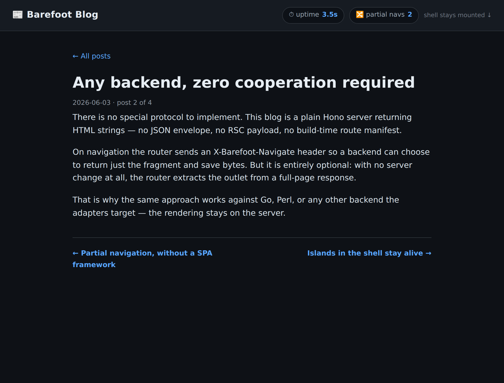

# Router blog — `@barefootjs/router` reference

A tiny blog that uses [`@barefootjs/router`](../../packages/router) for
**automatic partial navigation**: clicking a post swaps only the content
region and leaves the page shell mounted.

> **Reference implementation — not for merge.** This app exists to
> demonstrate and screenshot the router prototype (PR stacked on it).

## What it shows

| Screenshot | Demonstrates |
|---|---|
|  | First load. Shell shows `uptime 1.2s · partial navs 0`. |
|  | After clicking a post: body swapped, **`uptime 2.5s` (kept climbing) · partial navs 1**. |
|  | After paging forward: new body, **`uptime 3.5s` · partial navs 2**. |

The header is the proof. Its uptime clock starts **once** on first load —
if these navigations were full page reloads it would reset to `0.0s`
every time. It doesn't: the shell is never torn down, only the
`<main bf-outlet>` region is replaced, and the partial-nav counter (a
`MutationObserver` on the outlet) ticks up on each swap.

## How it works

- **Server** (`server.ts`): plain Hono returning **HTML strings** — no
  JSX, no JSON envelope, no route manifest. Each route hands a `body` to
  `respond()`, which returns the full page normally, or just the
  `<main bf-outlet>` fragment when the router's `X-Barefoot-Navigate`
  header is present (payload optimization; `Vary` is set).
- **Client** (`client/entry.ts`): boots a plain-JS shell island (uptime
  clock + nav counter) and calls `startRouter()`. Bundled to
  `public/entry.js` with `bun build`.

The shell island is plain JS on purpose — it keeps the reference
self-contained and underlines that the router is framework-agnostic. In
a full BarefootJS app it would be a compiled `"use client"` island; the
router treats both identically.

## Run it

```sh
bun install
cd integrations/router-blog
bun run start        # build client bundle + serve on http://localhost:8787
```

## Regenerate the screenshots

Needs a Chromium that Playwright can launch:

```sh
bun run serve &                     # in one shell
CHROME_PATH=/path/to/chrome bun run capture   # asserts behaviour + writes screenshots/
```

`capture.ts` fails if the content doesn't swap, the title doesn't update,
the uptime resets, or the nav counter doesn't reach 2 — so the
screenshots can't silently drift from the claims above.
