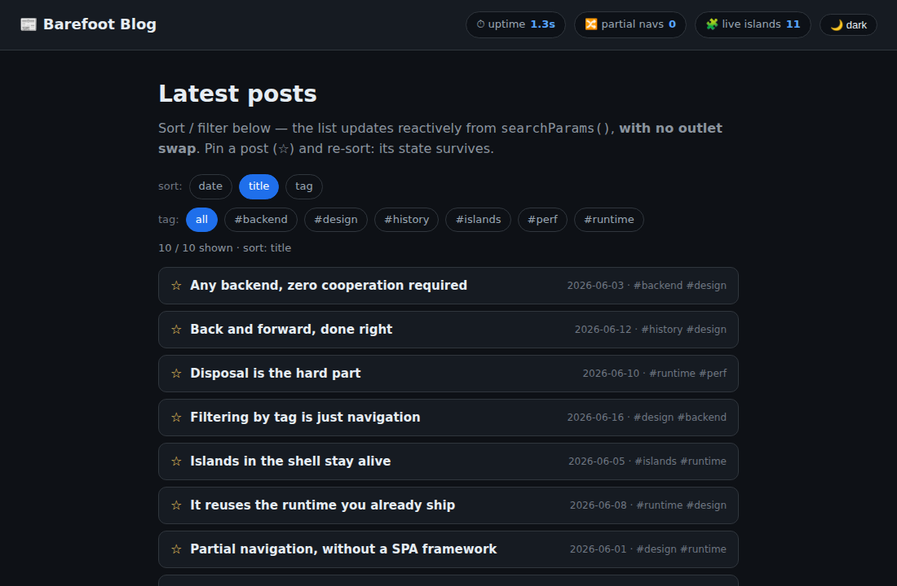
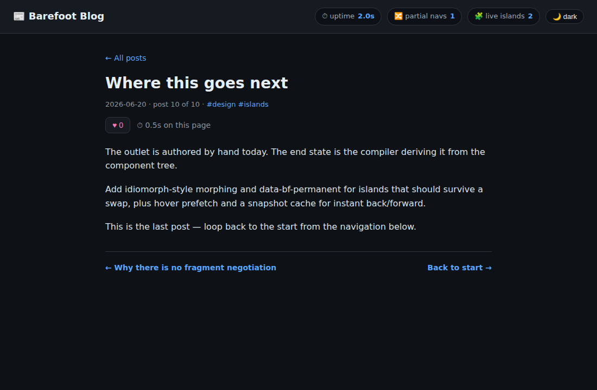

# Router blog — `@barefootjs/router` reference (real-component edition)

A small blog built on [`@barefootjs/router`](../../packages/router) for
**automatic partial navigation**: clicking a post swaps only the
`<main bf-outlet>` content and leaves the page shell mounted; clicking a
`?sort=` / `?tag=` link re-orders/filters the list **reactively with no
outlet swap at all**.

Unlike the earlier router-blog exploration (PR #1891), every island here is a
**real compiled BarefootJS `"use client"` component** hydrated by the **real
`@barefootjs/client` runtime** — the router drives the actual
`__bf_hydrate_within` / `__bf_dispose_within` seams, not a hand-written
stand-in. So this doubles as an end-to-end integration test of the router
against the shipping compiler + runtime.


## What it shows

| Screenshot | Demonstrates |
|---|---|
|  | First load: the index list + sort/tag controls. The shell shows `uptime · partial navs · live islands`, all hydrated once. |
|  | **`searchParams()`:** clicking `sort` / `tag` re-orders/filters the list reactively — **`partial navs` stays 0** (no outlet swap) while the list and the controls' active state update. A pinned post keeps its state across a re-sort. |
|  | After opening a post: the body is swapped in, **uptime kept climbing**, `partial navs` ticked. The ♥ like + ⏱ timer are outlet islands — hydrated on the way in, disposed on the way out. |

The header is the proof: its uptime clock and theme toggle start **once**. A
full reload would reset them. Only `<main bf-outlet>` is replaced.

## Components (all real `"use client"`)

| Component | Where | Role |
|---|---|---|
| `ShellStats` | shell | uptime clock + a `MutationObserver` partial-nav counter + live-island gauge |
| `ThemeToggle` | shell | flips `data-theme`; the choice survives navigation |
| `PostList` | outlet | the index; reads `searchParams()` to sort/filter with no swap; reactive sort/tag bars |
| `PostListItem` | outlet | one keyed row with a local pin toggle (state survives re-sort) |
| `LikeButton` | outlet | local like counter — re-created per navigation |
| `ReadingTimer` | outlet | a `setInterval` timer wired through `onCleanup` — the disposal stress case |

## How it works

- **Server** (`server.tsx`): plain Bun + Hono. Every route returns the **full
  page**; the router extracts `[bf-outlet]` client-side (no
  content-negotiation header, no route table). 10 posts, `?tag=` filtering,
  `?sort=` ordering.
- **Compile** (`bf build`): the `.tsx` islands compile to `*.client.js` +
  `barefoot.js`. `BfScripts` emits the module scripts at body end; the router
  reads them off each navigation response to load any newly-required island
  before re-hydrating.
- **Bootstrap** (`client/router-entry.ts`): installs the runtime seams
  (`setupStreaming`), loads `@barefootjs/router/signals`, and starts the
  router. `client/router-signals.ts` is the single shared signals module the
  import map points `@barefootjs/router/signals` at (see "Gotchas" below).

## Run it

```sh
bun install
cd integrations/router-blog
bun run start        # setup deps + bf build + client bundles + serve on http://localhost:8788
```

`start` runs `setup` first, which builds the workspace packages this example
imports at runtime (`@barefootjs/shared`, `@barefootjs/jsx`,
`@barefootjs/client`, `@barefootjs/hono`). Those packages' `exports` resolve to
`dist/`, so on a fresh clone the server would otherwise fail with
`Cannot find module '@barefootjs/client/reactive'` (the SSR side of
`searchParams()` imports it). Run `setup` once; after that, iterate with
`bun run build && bun run serve` (or just `bun run serve`).

Verify behavior in a real browser (drives the router through 17 assertions —
swap, shell persistence, `searchParams()` no-swap, pin survival, disposal,
back/forward, console errors):

```sh
PORT=8788 bun run server.tsx &
bun run scripts/verify.ts
bun run scripts/capture.ts    # writes screenshots/
```

## `searchParams()` + SSR

`searchParams()` has no server request-awareness of its own (on the server it
reads `''`). For the index to SSR the *correct* filtered/sorted list for
`/?tag=perf`, `server.tsx` primes the signal with `setSearch(url.search)`
before rendering. The client then reads `location.search` and reconciles to
the same result, so there is no flash. See the feedback notes on PR #1910 for
why this priming should move into the adapter (and why the module-global
signal is unsafe under concurrent SSR).

## Gotchas found while building this (filed against #1910)

1. The router's disposal/re-hydration seams are **not auto-installed** — the
   app must call `@barefootjs/client`'s `setupStreaming()`. Following the
   router README's `startRouter()`-only usage leaves disposal a silent no-op.
2. `defaultDispose` has **no fallback** (unlike `defaultRehydrate`), so
   without `setupStreaming()` outgoing islands leak silently.
3. `searchParams()` SSR is a module-global → needs request-scoped state.
4. `@barefootjs/router/signals` must be a **singleton module** shared by the
   router bootstrap and the island, or reactivity silently breaks — hence the
   single `router-signals.js` bundle + import-map entry.
