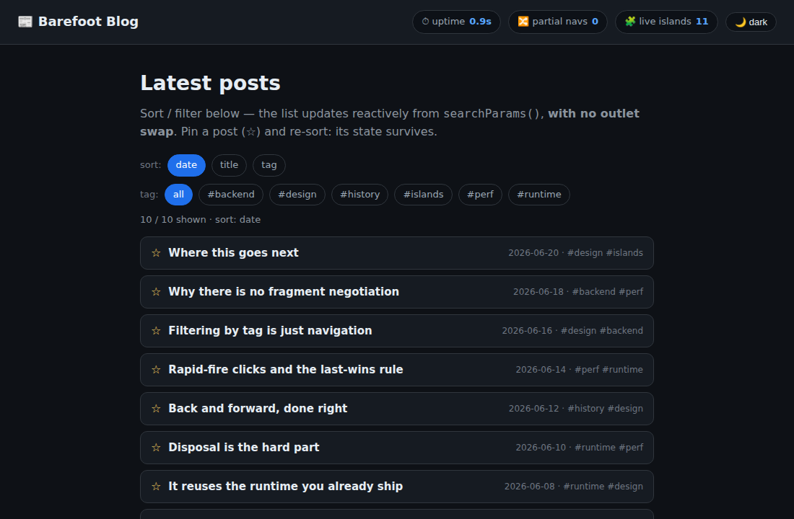
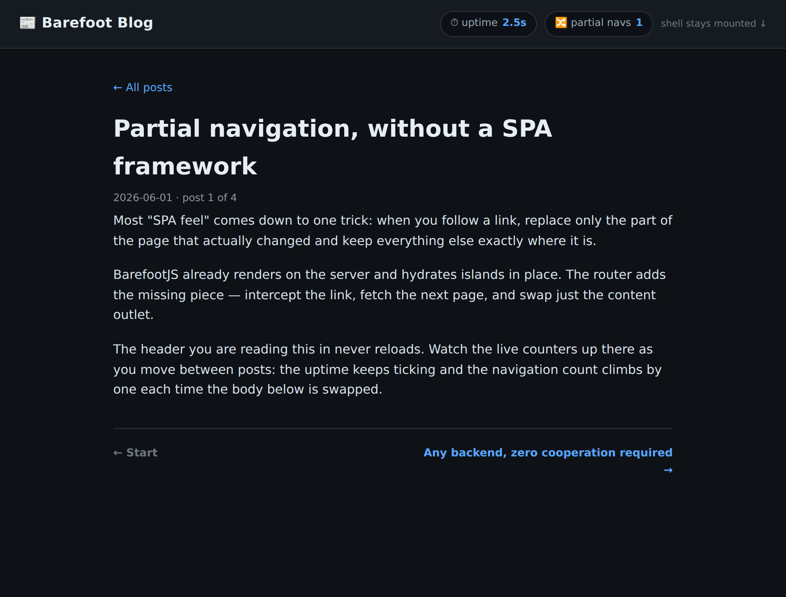
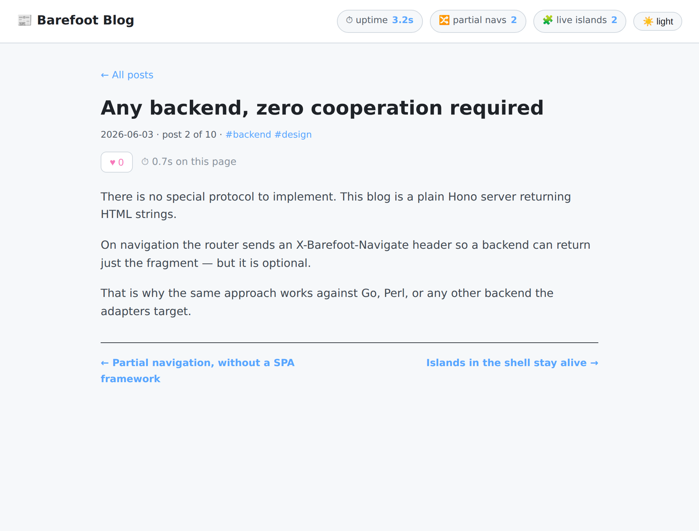

# Router blog — `@barefootjs/router` reference

A small blog that uses [`@barefootjs/router`](../../packages/router) for
**automatic partial navigation**: clicking a post (or a tag) swaps only
the content region and leaves the page shell mounted. Built to demonstrate
and **stress-test** the router prototype.

> **Reference implementation — not for merge.** PR stacked on the router PR.

## What it shows

| Screenshot | Demonstrates |
|---|---|
|  | First load: post list + tag filter. Shell shows `uptime · partial navs · live islands`. |
|  | After opening a post: body swapped, **uptime kept climbing**, `partial navs 1`, `live islands 2` (the ♥ like + ⏱ timer are outlet islands). |
|  | Theme toggled in the shell, then paged forward: **the theme persists** and `partial navs 2` — the shell was never reloaded. |

The header is the proof. Its uptime clock and theme start/sticky **once** —
a full reload would reset them. Only the `<main bf-outlet>` region is
replaced; the partial-nav counter (a `MutationObserver` on the outlet)
ticks up on each swap.

## How it works

- **Server** (`server.ts`): plain Hono returning **HTML strings** — no
  JSX, no JSON envelope, no route manifest. 10 posts, tag filtering via
  `?tag=`, and a `?delay=` knob (for the rapid-fire race test). Each route
  hands a `body` to `respond()`, which returns the full page normally, or
  just the `<main bf-outlet>` fragment when the router's
  `X-Barefoot-Navigate` header is present (`Vary` set).
- **Client** (`client/entry.ts`): shell islands (uptime, nav counter,
  live-island gauge, theme toggle) + an outlet hydrate/dispose contract
  wired through `window.__bf_hydrate` (the router's rehydrate seam) and
  the router's `dispose` hook. This stands in for the BarefootJS client
  runtime — in a full app the islands would be compiled `"use client"`
  components; the router treats both identically.

## Run it

```sh
bun install
cd integrations/router-blog
bun run start        # build client bundle + serve on http://localhost:8787
```

## Stress test & screenshots

Both need a Chromium that Playwright can launch (`CHROME_PATH`):

```sh
bun run serve &                              # in one shell
CHROME_PATH=/path/to/chrome bun run stress   # design smoke test → prints a report
CHROME_PATH=/path/to/chrome bun run capture  # asserts behaviour + writes screenshots/
```

`stress.ts` drives the router through outlet swap, re-hydration,
disposal/leak, the rapid-fire race, back/forward, query-string nav, and
throughput. Findings are written up in [`STRESS.md`](./STRESS.md) — last
run **8 pass / 0 fail**, with the disposal-leak gap measured and
documented. Both scripts exit non-zero if behaviour drifts from the
claims, so the docs can't silently rot.

## Design artifacts

- `bun run bench` — runtime-cost microbench (O(document) vs O(outlet)).
- `bun run routes-manifest` — P2 prototype: builds the [DESIGN.md](./DESIGN.md)
  §5.1 island/module rollup from a real `bf build` manifest (defaults to
  `../hono/dist/components/manifest.json`; run `bf build` in
  `integrations/hono` first). Proves the rollup is a pure transform of
  existing build output.
- [`DESIGN.md`](./DESIGN.md) — the IR-driven router design exploration.
