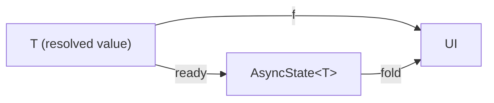
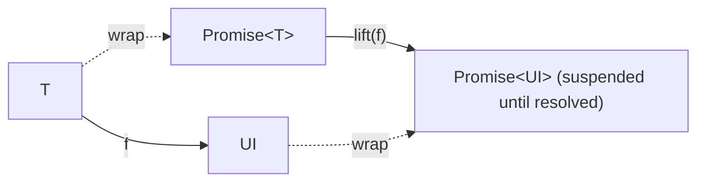
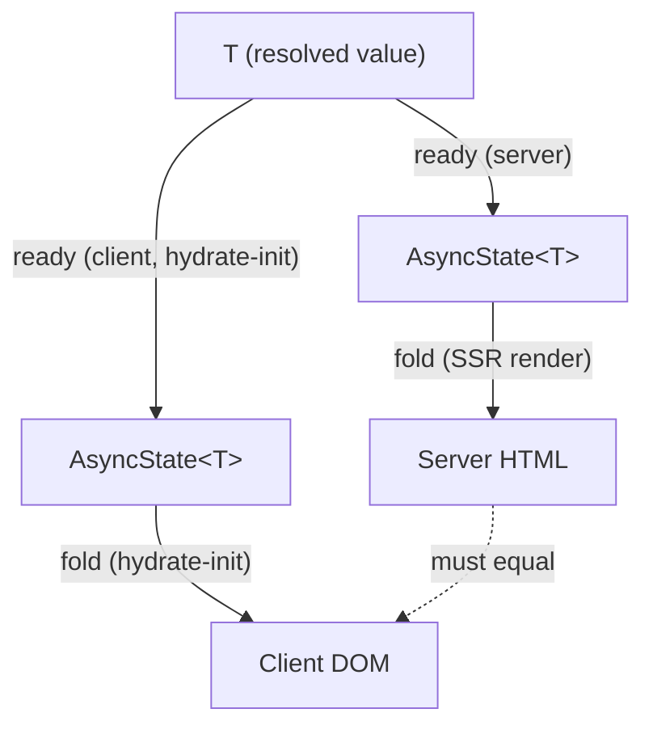
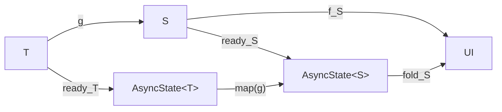
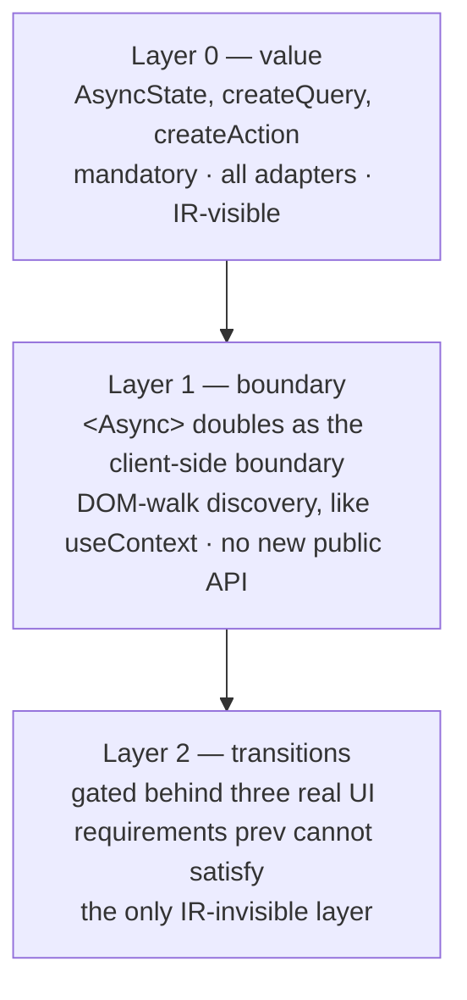

# Async Specification (Design Draft)

> **Status:** design. Nothing in this document is implemented yet — `AsyncState`,
> `createQuery` and `createAction` (layer 0, "Three layers" below) do not exist in
> `@barefootjs/client`. This spec fixes the model before any of it ships, in the style of
> [`router.md`](./router.md).

## 1. Values, not control flow

The compiler's whole model is `UI = f(state)`: a component is a pure, synchronous function
from its reactive state to markup. Async data has to fit that shape without breaking it, and
there are exactly two ways to fit "a value that isn't here yet" into `f`:

- **`f(async state)`** — `state` itself becomes a value that can *represent* "not yet", and
  `f` stays an ordinary synchronous function over it. This is BarefootJS's choice.
- **`async f(state)`** — `f` itself becomes asynchronous (or is *lifted* into one), and the
  runtime pauses rendering the subtree until it settles. This is Solid's and React's choice
  (`createResource` + `<Suspense>`, `use(promise)` + `<Suspense>`).

The "not yet" is a sum type:

```ts
type AsyncState<T, E = unknown> =
  | { status: 'pending' }
  | { status: 'ready'; value: T }
  | { status: 'error'; error: E }
```

(`createQuery`'s refresh case additionally carries `prev`, the last `ready` value, so a
component can keep showing stale data while a refetch is in flight; `createAction`'s
idle case is the pre-submission member of the same shape — see "Three layers" below.)

`f` never throws on a read and never awaits: a query's sync accessors (`q()`, `q.loading()`,
`q.error()`) return immediately, and the loading/error branches are **ordinary conditionals**
— the same `cond() && …` / ternary the compiler already lowers for `<Show>`, visible in the
IR exactly like any other branch. There is no second, invisible control-flow mechanism for
the async case.

### Fold vs lift

Read as a diagram, the fold model is a **triangle**: injecting a value and then folding must
land you back where a plain, synchronous render of that value would have.



The lift model changes the shape of `f` itself instead of the argument. Solid's
`createResource`/React's `use(promise)` conceptually lift `f: T -> UI` to operate over the
promise functor — the component doesn't run against `T` at all until the promise settles;
`<Suspense>` is what makes "hasn't settled yet" renderable in the meantime, by substituting
an entirely different tree (the fallback) above the suspended point.



The practical difference: under fold, the loading and error branches are *inside* `f`,
authored and visible like any other conditional. Under lift, they live *outside* `f`, in
whatever ancestor owns the nearest `<Suspense fallback>` — a form of dynamic scoping the fold
model deliberately does not have (see §6).

## 2. The law

**`fold ∘ ready = f`.** Injecting a value into the sum type and then folding must produce
exactly what directly rendering that value would have. This is not a stylistic preference —
it is what makes the `ready` branch of a query indistinguishable from an ordinary prop, which
is the entire point of modeling "arrived" as a case of the same type components already
render from.

Read across the SSR/CSR boundary, the law **is** hydration parity. The server computes
`fold(ready(x))` while producing HTML; the client, on hydrate-init, computes `fold(ready(x))`
again against the revived value; the two must be the same tree, or hydration mismatches. So
the law needs no bespoke test infrastructure — it is exactly one `renderToTest` fixture per
component that has a `ready` branch, the same layer the testing table already uses for
SSR/CSR equivalence.



A violation of this square is not a stylistic bug — it is a hydration mismatch, the same
class of defect the compiler already treats as an invariant to fix (CLAUDE.md: "Hydration
correctness is a compiler invariant").

## 3. Composition

Composing components needs no new law. `ready` is **natural**: transforming a value with a
plain function `g: T -> S` before or after wrapping it in `AsyncState` gives the same result
(`ready_S ∘ g = map(g) ∘ ready_T`). Pasting that naturality square against the child
component's own fold triangle (`fold_S ∘ ready_S = f_S`) composes for free:



The outer path (`T -> AsyncState<T> -> AsyncState<S> -> UI`) and the direct path
(`T -> S -> UI`) agree:

```
fold_S ∘ map(g) ∘ ready_T  =  f_S ∘ g
```

Concretely: a parent that derives a child's prop from a query's `ready` value (`g`) before
passing it down needs no extra hydration-parity test of its own — the child's own fixture
already covers `fold_S ∘ ready_S = f_S`, and naturality covers the rest. This is why layer 0
is the only mandatory layer (§4): once the sum type and its fold obey the law, nothing about
composing components over it needs new machinery.

## 4. Three layers



- **Layer 0 — value.** `AsyncState`, `createQuery`, `createAction`. Mandatory, ships on every
  adapter, and is IR-visible: the loading/error/ready branches a component authors compile
  the same way any other conditional does. This layer alone is the whole model — §§1–3 hold
  with nothing else.
- **Layer 1 — boundary.** `<Async>` already exists as the SSR streaming boundary (lowered to
  the adapter's streaming primitive, compiled away — see [API Reference](../docs/core/advanced/api-reference.md#async)).
  It doubles as the *client-side* boundary too: discovered by walking the DOM at runtime the
  way `useContext` discovers its provider, not by a second, parallel public API surface.
- **Layer 2 — transitions.** `useTransition`-shaped pending/start, gated behind three real UI
  requirements that `prev` (the refresh case's stale-value carry-over, §1) cannot satisfy on
  its own. The only layer of the three that is not visible in the IR — everything in layers 0
  and 1 compiles to ordinary conditionals and a recognized import; a transition is scheduling,
  which has no IR shape to begin with.

**Adoption criterion.** An API belongs in this design if it is a **lift** (`ready`), a
**fold** (the branch a component authors over `AsyncState`), or a **natural combinator** over
the sum type (§3's `map`). Scheduling, presentation (View Transitions), and error boundaries
for *unanticipated* errors are out — none of them are a lift, a fold, or a natural
transformation of `AsyncState`; they are cross-cutting runtime behavior the fold model was
never meant to carry.

## 5. The two SSR modes

- **Mode A — embedded.** The server has the data by the time it renders, so it renders the
  `ready` case directly: the HTML the client hydrates already contains the resolved value,
  and hydrate-init's `fold(ready(x))` matches it by the law in §2. No loading state is ever
  visible to a user on this path.
- **Mode B — shell.** The server renders the `pending` fallback (there is no value yet, by
  design or by deadline), ships that HTML, and the client fetches and fills in after hydration
  — an ordinary `pending -> ready` transition once the browser has taken over, driven by the
  same `AsyncState` a `createEffect` would already re-render from.

Both modes are the same component compiled once; which mode a given request takes is a
runtime decision (did the query resolve before the server needed to flush), not a second
authoring surface.

## 6. What the fold model cannot express, and where it is recovered

- **No dynamic scoping.** An ancestor cannot discover a descendant's pending state the way a
  `<Suspense fallback>` ancestor can under the lift model — there is no implicit channel
  carrying "something below me is still loading" upward. This is a direct consequence of §1:
  the loading branch lives *inside* the component that owns the query, not in whatever
  ancestor happens to be nearest.
- **Page-level continuity is the router's job**, not the async layer's: prefetch and
  stale-while-revalidate across a navigation are [`spec/router.md`](./router.md)'s Suspense /
  streaming section, not this layer. The router owns continuity; the async layer owns the
  value. Component-level continuity across a *re-render* (not a navigation) is layers 1 and 2
  above.
- **React-style render-suspend-retry is out, for good** — not a temporary gap. A compiled
  BarefootJS component's output is a template plus an `init` function; there is no
  "render, discover a missing value, throw, and retry" step to hook into, because there is no
  retry-able render call to begin with. Any async capability this project adds has to fit the
  fold shape in §1, not reintroduce a suspend-and-retry loop underneath it.

## 7. Constraint on `createQuery`

`createQuery` cannot ship as an ordinary brand package. The brand-package mechanism's
auto-defer rule makes any `Reactive<>`-branded read client-only by construction — exactly
backwards for a query, whose whole point is that a resolved `ready` value renders in the
*server* HTML (mode A, §5). So `createQuery` has to be a **builtin lowering plugin**: the
query's `initial` seed is lowered directly into every adapter's own template at compile time
(the same registry `queryHref` already uses, [`packages/jsx/src/builtin-lowering-plugins.ts`](../packages/jsx/src/builtin-lowering-plugins.ts)),
not a brand-packaged runtime call the SSR path would have to skip. Rendering a `pending`
placeholder that never resolves on the server, then re-deferring the read on the client, is
exactly the failure this constraint avoids. A related silent gap is already on file as the
`opaque-local-accessor-call` known limitation
(`packages/adapter-tests/limitations/opaque-local-accessor-call.ts`): a local accessor the
compiler cannot evaluate (`const q = someCall()`, then `{q()}`) lowers to an empty slot with no
diagnostic on every DSL adapter. Layer 0 has to be built so that shape cannot happen for
`createQuery` specifically, not merely documented as a risk.
