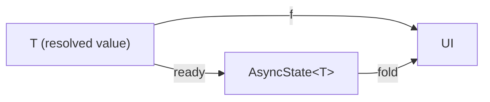
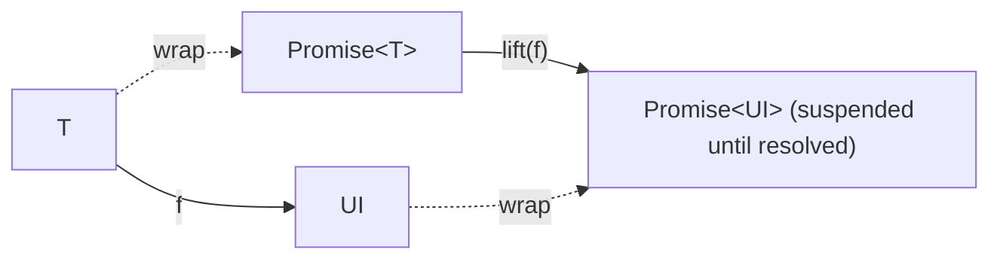
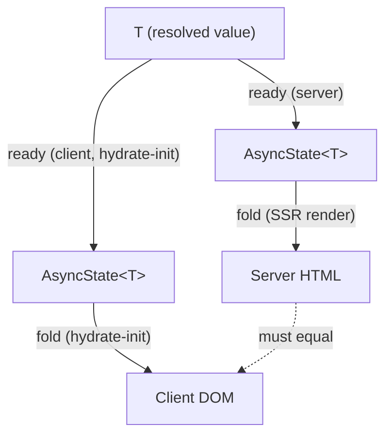
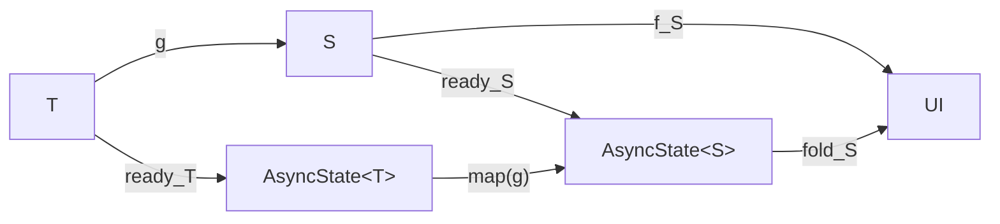
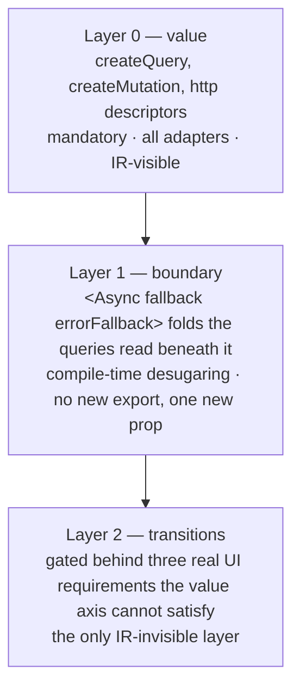

# Async Specification (Design Draft)

> **Status:** design. Nothing in this document is implemented yet — `createQuery`,
> `createMutation` and the `http` request descriptors (layer 0, "Three layers" below) do not
> exist in `@barefootjs/client`. This spec fixes the model before any of it ships, in the
> style of [`router.md`](./router.md).

## 1. Values, not control flow

The compiler's whole model is `UI = f(state)`: a component is a pure, synchronous function
from its reactive state to markup. Async data has to fit that shape without breaking it, and
there are exactly two ways to fit "a value that isn't here yet" into `f`:

- **`f(async state)`** — `state` itself becomes a value that can *represent* "not yet", and
  `f` stays an ordinary synchronous function over it. This is BarefootJS's choice.
- **`async f(state)`** — `f` itself becomes asynchronous (or is *lifted* into one), and the
  runtime pauses rendering the subtree until it settles. This is React's choice
  (`use(promise)` + `<Suspense>`) and, since 2.0, Solid's (`createMemo` returning a promise,
  `NotReadyError` propagating to the nearest `<Loading>` / `<Errored>` boundary).

Conceptually the "not yet" is a sum type:

```ts
type AsyncState<T, E = unknown> =
  | { status: 'pending' }
  | { status: 'ready'; value: T }
  | { status: 'error'; error: E }
```

At runtime it is carried on **two independent axes** rather than as one tagged object (§7.3):
the *value* axis (`T | undefined`, the last value known) and the *settlement* axis
(`isPending()` / `error()` of the last request sent). Keeping them apart is what lets the
value survive a refetch and lets the type of the value be decided by its seed alone.

`f` never throws on a read and never awaits: the accessors are synchronous, and the
loading/error branches are **ordinary conditionals** — the same `cond() && …` / ternary the
compiler already lowers for `<Show>`, visible in the IR exactly like any other branch. There
is no second, invisible control-flow mechanism for the async case.

### Fold vs lift

Read as a diagram, the fold model is a **triangle**: injecting a value and then folding must
land you back where a plain, synchronous render of that value would have.



The lift model changes the shape of `f` itself instead of the argument. React's
`use(promise)` and Solid 2.0's async memos conceptually lift `f: T -> UI` to operate over the
promise functor — the component doesn't run against `T` at all until the promise settles;
`<Suspense>` / `<Loading>` is what makes "hasn't settled yet" renderable in the meantime, by
substituting an entirely different tree (the fallback) above the suspended point.



The practical difference: under fold, the loading and error branches are *inside* `f`,
authored and visible like any other conditional. Under lift, they live *outside* `f`, in
whatever ancestor owns the nearest boundary — a form of dynamic scoping the fold model
deliberately does not have (see §6).

Solid 2.0 could drop `createResource` because the same reactive graph runs on the server and
the runtime owns scheduling, so "pending" could move from a special node kind to a status
any node may have. Neither precondition holds here (§6, "React-style render-suspend-retry is
out"), and pending must stay **visible in the IR** as a value. Solid made the graph smarter
and removed the primitive; BarefootJS keeps the graph synchronous and keeps the primitive.

## 2. The law

**`fold ∘ ready = f`.** Injecting a value into the sum type and then folding must produce
exactly what directly rendering that value would have. This is not a stylistic preference —
it is what makes the `ready` branch of a query indistinguishable from an ordinary prop, which
is the entire point of modeling "arrived" as a case of the same type components already
render from.

Read across the SSR/CSR boundary, the law **is** hydration parity. The server computes
`fold(ready(x))` while producing HTML; the client, on hydrate-init, computes `fold(ready(x))`
again against the revived value; the two must be the same tree, or hydration mismatches. So
the law needs no bespoke test infrastructure — it is exactly one `renderToTest` fixture per
component that has a `ready` branch, the same layer the testing table already uses for
SSR/CSR equivalence. Concretely: rendering the async component with `initial` supplied must
equal rendering its synchronous twin with the same value as a prop; rendering it without
`initial` must produce the "no value" branch.



A violation of this square is not a stylistic bug — it is a hydration mismatch, the same
class of defect the compiler already treats as an invariant to fix (CLAUDE.md: "Hydration
correctness is a compiler invariant").

## 3. Composition

Composing components needs no new law. `ready` is **natural**: transforming a value with a
plain function `g: T -> S` before or after wrapping it in `AsyncState` gives the same result
(`ready_S ∘ g = map(g) ∘ ready_T`). Pasting that naturality square against the child
component's own fold triangle (`fold_S ∘ ready_S = f_S`) composes for free:



The outer path (`T -> AsyncState<T> -> AsyncState<S> -> UI`) and the direct path
(`T -> S -> UI`) agree:

```
fold_S ∘ map(g) ∘ ready_T  =  f_S ∘ g
```

Concretely: a parent that derives a child's prop from a query's value (`g`, an ordinary
`createMemo`) before passing it down needs no extra hydration-parity test of its own — the
child's own fixture already covers `fold_S ∘ ready_S = f_S`, and naturality covers the rest.
`createMemo` stays a synchronous, pure derivation: pending does **not** propagate through it
(as it does through Solid 2.0's memos); the author folds `undefined` with `?.` or a branch,
and the SSR static-evaluation chain resolves the memo's seed from the query's `initial`.
This is why layer 0 is the only mandatory layer (§4): once the sum type and its fold obey
the law, nothing about composing components over it needs new machinery.

## 4. Three layers



- **Layer 0 — value.** `createQuery`, `createMutation`, and the `http` request descriptors
  (§7). Mandatory, ships on every adapter, and is IR-visible: the loading/error/ready
  branches a component authors compile the same way any other conditional does. This layer
  alone is the whole model — §§1–3 hold with nothing else.
- **Layer 1 — boundary.** `<Async>` already exists as the SSR streaming boundary (lowered to
  the adapter's streaming primitive, compiled away — see [API Reference](../docs/core/advanced/api-reference.md#async)).
  On the client it doubles as a *fold* over the queries read directly beneath it (no new
  export; `errorFallback` is one new prop on the existing element, which today has only
  `fallback` and `children`):
  `<Async fallback>` desugars to the value-axis branch (`a() === undefined || b() === undefined`),
  `<Async errorFallback={(error, reset) => …}>` to the settlement-axis branch
  (`fetchA.error() ?? fetchB.error()`, `reset` re-sends). Both are ordinary conditionals in
  the IR — no `NotReadyError`, no runtime registration. The scope is the queries read in the
  same component; a child component's queries are not visible to a parent's boundary (§6).
- **Layer 2 — transitions.** `useTransition`-shaped pending/start, gated behind three real UI
  requirements that the value axis's stale-value carry-over (§7.3) cannot satisfy on its own.
  The only layer of the three that is not visible in the IR — everything in layers 0 and 1
  compiles to ordinary conditionals and a recognized import; a transition is scheduling,
  which has no IR shape to begin with. Solid 2.0 removed `startTransition` / `useTransition`
  and made "hold the old values until everything below settles" the default; that counts as
  one vote at the gate, not as a decision.

**Adoption criterion.** An API belongs in this design if it is a **lift** (`ready`), a
**fold** (the branch a component authors over `AsyncState`), or a **natural combinator** over
the sum type (§3's `map`). Scheduling, presentation (View Transitions), and error boundaries
for *unanticipated* errors are out — none of them are a lift, a fold, or a natural
transformation of `AsyncState`; they are cross-cutting runtime behavior the fold model was
never meant to carry.

## 5. The two SSR modes

- **Mode A — embedded.** The server has the data by the time it renders, so it renders the
  `ready` case directly: the HTML the client hydrates already contains the resolved value,
  and hydrate-init's `fold(ready(x))` matches it by the law in §2. No loading state is ever
  visible to a user on this path. In the API this is `initial` supplied from a **required**
  prop, so the value's type is `T` and the component reads it with no fold at all.
- **Mode B — shell.** The server renders the "no value" branch (there is no value yet, by
  design or by deadline), ships that HTML, and the client fetches and fills in after hydration
  — an ordinary `undefined -> value` transition once the browser has taken over. In the API
  this is `initial` omitted (an **optional** prop), so the value's type is `T | undefined`
  and the component folds it with `!posts() ? <Skeleton/> : …`.

Both modes are the same component compiled once; which mode a given request takes is
whether the prop was supplied, which the props type makes visible. The mode is not a second
authoring surface.

## 6. What the fold model cannot express, and where it is recovered

- **No dynamic scoping.** An ancestor cannot discover a descendant component's pending state
  the way a `<Suspense fallback>` ancestor can under the lift model — there is no implicit
  channel carrying "something below me is still loading" upward. This is a direct consequence
  of §1: the loading branch lives *inside* the component that owns the query, not in whatever
  ancestor happens to be nearest. Layer 1 recovers it only within one component (the compiler
  can see which queries a subtree reads); across components the answer is composition: the
  parent owns the query and passes values down, or a shared error component receives the
  action as a prop (`<ErrorCard request={fetchPosts}/>`) and reads `props.request.error()`.
- **Page-level continuity is the router's job**, not the async layer's: prefetch and
  stale-while-revalidate across a navigation are [`spec/router.md`](./router.md)'s Suspense /
  streaming section, not this layer. The router owns continuity; the async layer owns the
  value. Component-level continuity across a *re-render* (not a navigation) is layers 1 and 2
  above.
- **React-style render-suspend-retry is out, for good** — not a temporary gap. A compiled
  BarefootJS component's output is a template plus an `init` function; there is no
  "render, discover a missing value, throw, and retry" step to hook into, because there is no
  retry-able render call to begin with. Any async capability this project adds has to fit the
  fold shape in §1, not reintroduce a suspend-and-retry loop underneath it.

## 7. Layer 0 API

### 7.1 Shape

```tsx
import { createQuery, createMutation, http } from '@barefootjs/client'

// query — re-sent whenever a signal read inside the function changes
const [posts, fetchPosts] = createQuery(
  () => http.get('/api/posts', { page: page() }),   // a function, like createMemo / createEffect
  { initial: props.posts, ttl: 15_000 },
)
posts()                  // T | undefined — initial → previous value → resolved value; T when initial is a required prop
fetchPosts()             // re-send with the current function; Promise<T>
fetchPosts.isPending()   // boolean — the last send has not settled
fetchPosts.error()       // E | undefined — the last send failed; cleared by the next success

// mutation — sent only when the action is called; the function is evaluated untracked at send time
const [saved, saveComment] = createMutation(
  () => http.post('/api/comments', { postId: props.id, body: draft() }),
  { invalidates: ['/api/posts'] },
)
<button disabled={saveComment.isPending()} onClick={() => saveComment()}>Post</button>
```

Both factories return `[value, action]` — noun, verb — the same shape as
`createSignal`'s `[count, setCount]`. `action` is callable and carries two reactive
accessors, `isPending` and `error`, the same accessor-on-a-factory-result pattern
`createForm` already uses (`form.isSubmitting()`, `field.error()`). They are properties of
the *action*, not of the value getter, so BF044 (a getter passed uncalled) does not apply.

`createSignal` and `createMemo` are unchanged. `createQuery` and `createMutation` are
**recognised composites** — at runtime a signal plus an effect, like `createForm` — that the
compiler recognises as reactive factories so it can read the SSR seed (`initial`) and lower
the action accessors. The v0 export surface of this layer is exactly three names:
`createQuery`, `createMutation`, `http`.

### 7.2 The request function and `http`

The first argument is a **function**, written like a memo or effect body: the signals it
reads are its dependencies (automatic tracking, synchronous prefix only). The compiler emits
it into the client JS the way it emits an effect body (props rewritten to live reads) and
never evaluates it during SSR. It was briefly specified as a bare expression the compiler
would wrap; that made `createQuery`'s argument the one place outside JSX where an expression
is re-evaluated, so the explicit function stays — one token buys the absence of a special
rule.

**One send per tick.** The function is an effect body, and the reactive runtime dispatches a
write synchronously in subscription order with no topological stage: behind a diamond (one
signal read through two memos) the body is re-run once with a half-updated snapshot before
the consistent one (pinned by the `diamond-propagation` fixture under the
`diamond-propagation-glitch` registry limitation,
`packages/adapter-tests/limitations/diamond-propagation-glitch.ts`). Because building a
descriptor is pure (below), that extra evaluation is harmless as long as nothing is sent
from inside the run: the runtime records the descriptor each run produces and sends once, at
the end of the current tick (a microtask), so only the last key a tick produced goes out. This
is the same "same tick" window §7.7's batcher uses, and it delays nothing the user can see —
the send still leaves before the handler's frame is painted. A bare-`Promise` function (below)
gets no such protection, which is one more reason to prefer descriptors.

The function returns a **request descriptor** built by the `http` namespace:

| Constructor | Returns | Notes |
|---|---|---|
| `http.get(url, params?)`, `http.head(url, params?)` | descriptor with a *safe* method | `params` values are `string \| number \| boolean \| (string \| number)[] \| null \| undefined`; `null`/`undefined`/`''` are omitted, an array appends one entry per member. **Not** `queryHref`'s string-only rule — descriptors are never lowered to an SSR template, so the SSR-parity reason for string-only values doesn't apply, and `0`/`false` are kept (stringified, not treated as falsy) |
| `http.query(url, body?)` | descriptor with a *safe* method (HTTP QUERY: a read with a body) | `body` is JSON |
| `http.post(url, body?)`, `http.put(url, body?)`, `http.patch(url, body?)`, `http.delete(url, body?)` | descriptor with an *unsafe* method | `body` is JSON |
| third argument on any of them | `{ headers, credentials }` | |

**Response handling is JSON-only in v0** (issue #3156). `sendRequest` — the internal function
`createQuery` sends through — sends with `Content-Type: application/json; charset=utf-8` when
there is a body (a `Content-Type` in `init.headers`, in any casing, replaces it), and parses a successful response with `response.json()`; a successful `HEAD` resolves
to `undefined` (a `HEAD` response has no body). A non-2xx response, `HEAD` included, rejects
with `HttpError`, carrying `{ status: number; body: unknown }` — `body` is the response parsed
as JSON when possible, else raw text, else `undefined`. A network failure (the `fetch` call
itself rejecting) rejects with the underlying error unchanged, not wrapped in `HttpError`.

Descriptors are **pure data** — constructing one performs no I/O. That purity is load-bearing
three times over:

- the **cache key** is `method + url + stable serialisation of body`, computable before
  anything is sent;
- during **init** the function can be evaluated to learn the initial key without a request
  going out, so `initial` can be primed into the cache (§7.5);
- the same descriptor from two islands is the same key, so **cross-island sharing** and
  single-flight fall out without a registry (the old `query('name', fn)` definition-side API
  is gone).

The namespace is one identifier so the constructors can use plain lowercase method names
without colliding with user code (`get`, `delete`); a collision with a local `http` is
resolved per file with `import { http as h }`. `http.delete` is a property name, legal like
`Map.prototype.delete`.

The function may instead return a `Promise` directly (`createQuery(() => db.get(id()))`) for
I/O the runtime does not own. Then the key is a compiler-assigned site id (component name +
binding name) plus the values of the signals read synchronously, and `initial` is primed
lazily (the first navigation back to the initial key re-fetches once). Pass `key` to opt back
into eager priming. The read/write distinction is carried by the factory name, so a bare
Promise never needs to declare a trigger.

**Reuse the descriptor, not the query.** Share `postsAt = (page) => http.get('/api/posts', { page })`
as an ordinary function and write `createQuery(() => postsAt(page()), …)` in each component.
Wrapping `createQuery` itself in a helper forces the compiler through the reactive-factory
inliner (#2325 / #2332) and its constraints (BF111–BF114; module-scope constants in the
helper's file are BF112), because the SSR seed must be visible at the call site — the
non-JS backends cannot evaluate a helper to find it.

### 7.3 Two axes

| | value present | value absent |
|---|---|---|
| `isPending()` | refetching; previous value stays visible | first fetch (mode B), or a mutation in flight |
| `error()` | refetch failed; previous value stays, alert on the error | first fetch failed, or a mutation failed |
| neither | steady state | `initial` omitted and nothing sent yet |

The **value axis** is decided by `initial`'s type alone: a required prop makes `value()` a
`T`, an optional prop makes it `T | undefined`. The value survives a refetch and an error
(`prev` is not a separate case). The **settlement axis** describes the last request the
action sent and implies nothing about the value; "neither pending nor error, and no value" is
a legitimate state (mode B's SSR, a mutation not yet called), so `idle` is not a case either.
This is TanStack Query v4's `status` / `fetchStatus` split and Solid 2.0's
`<Loading>` (no value yet) vs `isPending` (refetch) split.

**SSR seeds the settlement axis with exactly one value**: `isPending()` is `false`,
`error()` is `undefined`. The request function never runs on the server, so no send exists
there; "no value yet" is expressed on the value axis, never as a pending flight. This is why
the seed needs no rule at all.

### 7.4 Read vs write

| | `createQuery` | `createMutation` |
|---|---|---|
| when it sends | whenever a dependency changes; `action()` re-sends | only when `action()` is called; the function is evaluated untracked |
| `initial` | yes | rejected (diagnostic) |
| cache | keyed by the descriptor, `ttl` | none; `invalidates` |
| expected descriptors | safe methods; an unsafe method is allowed (a read-only POST) | unsafe methods; a safe method is a warning |

Every other library also separates these (`useQuery` / `useMutation`, `createResource` /
`action`): a read is a derivation that re-runs on its inputs, a write is an event. An earlier
draft unified them under one factory and let the HTTP method's safety pick the trigger; it
was dropped because the same call shape then behaved differently by an argument's content,
and a bare Promise had no method to decide by. The method is now a **check**, not the
decision.

`action()` returns `Promise<T>`, so `await saveComment()` before navigating is expressible.
`invalidates: ['/api/posts']` marks every cached query whose key starts with that prefix
stale on success and rides the router's invalidation bus, so the page cache is evicted
with it (a mutation that only evicted the query cache would let a later navigation restore
the pre-mutation HTML from the page cache).

### 7.5 Options

| Option | Factory | Meaning | Default |
|---|---|---|---|
| `initial` | query | the **already-obtained result** of the initial request. When present the first send is skipped and, when the key is known, the value is primed into the cache as fresh. Not a placeholder | none; `value()` is `T \| undefined` |
| `ttl` | query | freshness window; a stale entry is re-fetched on the next read. Applies to `initial` | the router page cache's fresh window (15 s); `0` for revalidate-on-load (SSG) |
| `key` | query | override the key: share across components, or prime eagerly for a bare-Promise function | descriptor key, else site id + dependency values |
| `invalidates` | mutation | key prefixes to mark stale on success | none |

`initial` is not Angular's `defaultValue` / TanStack's `placeholderData`. Writing
`initial: []` to avoid `undefined` in mode B claims the server rendered an empty list and
**suppresses the fetch**; the placeholder is `posts() ?? []` or a memo. The one assumption
the design rests on: `initial` is the initial request's own result (enforceable as
`initial: Awaited<ReturnType<…>>`). A parent that passes transformed data while the child
re-fetches the same key is a double source of truth; document it, do not special-case it.

### 7.6 The init rule does not depend on SSR

1. `initial` comes from props. Who produced the props is irrelevant.
2. During init, if `initial` is present the first send does not happen; for a descriptor
   function the key is computed (no request goes out) and `initial` enters the cache fresh.
3. `ttl` decides how long it stays fresh.

| Setup | props come from | outcome |
|---|---|---|
| SSR (mode A) | server, per request, via `bf-p` | no re-fetch; cached |
| SSG + hydrate | build-time `bf-p` | no re-fetch; freshness per `ttl` |
| SSG shell + CSR (mode B) | `props.posts` undefined | fetch; `!posts()` renders the skeleton |
| pure CSR mount | the parent's JS | seeded if passed, else fetch |
| router region swap | page-cache HTML | as SSR |
| re-mount on the same page | irrelevant | the cache answers synchronously; no send |

Of the five problems React's "don't fetch in useEffect" guidance lists, "effects don't run on
the server" and "waterfalls" are solved by this architecture's props-first order, "no cache"
and "races" move into the key and the generation guard (an older resolution never overwrites
a newer send), and the remaining "boilerplate" is one line. Mode B and pure CSR degrade to
React's "fetch after mount", with the cache and the race guard still in place.

### 7.7 Reserved, not specified

- **`createSubscription`** — the third GraphQL operation, for values that keep arriving
  (`http.ws`, `http.sse`, polling, any `AsyncIterable`). Same `[value, action]` shape, with
  `isOpen()` in place of `isPending()`, `initial` as the SSR snapshot, connections shared per
  descriptor, and mandatory close on dispose. Expressible today with an effect, `onCleanup`
  and a setter; the vocabulary is reserved so the two-factory shape is not designed into a
  corner. Not part of v0.
- **Batching, prefetch, retry, an offline write queue** — all consequences of descriptors
  being data (a batcher registered per URL collects same-tick descriptors into one request
  and splits the response; the window must stay "same tick" so the first request is never
  delayed). Runtime policies; none of them change a component. Not part of v0.
- **`<Async>`'s client-side fold (layer 1)** — after layer 0.

### 7.8 What the implementation PR must pin

Compiler: `action.isPending()` / `error()` lower on all nine adapters (seeds `false` /
`undefined`); `options.initial` seeds the value on all nine adapters without the same-name
prop collision (#2669); the request function is emitted like an effect body and never
evaluated by the SSR shim or the CSR template lambda; an unrecognised tuple-returning
factory becomes a **loud** diagnostic (today it silently turns into a prop accessor — the
same shape as the `opaque-local-accessor-call` entry in the limitation registry,
`packages/adapter-tests/limitations/opaque-local-accessor-call.ts`; extend that entry and
its fixture rather than filing a second one); hydration parity for
mode A and mode B via `renderToTest` with and without `initial`; the method check
(`createMutation` with a safe method warns).

Runtime: descriptor purity and key stability (body serialisation independent of key order);
one send per tick (a diamond in the function's dependencies — the `diamond-propagation`
fixture's shape — produces exactly one request, keyed by the consistent snapshot);
the init rule (`initial` present → no send, cached, re-fetched after `ttl`; absent → send);
mutation trigger and `invalidates`; the generation guard on `1 → 2 → 1` dependency changes;
previous-value retention across pending and error, `error` cleared by the next success;
disposal drops in-flight resolutions (the query is owned by its scope, so `disposeScope`
on a region swap or a removed `.map()` row releases it and nothing leaks across
navigations).

Around it: the memo chain resolves its SSR seed from `initial`; the value type follows the
prop's optionality; `bf debug graph` shows query nodes with edges from the signals the
function reads (a query is a signal source; one the graph does not show cannot be traced).
Per `subset-conformance.md`'s change-time coupling rule, the factory,
its fixtures, the runtime unit tests and this spec's status line land in the same PR.
